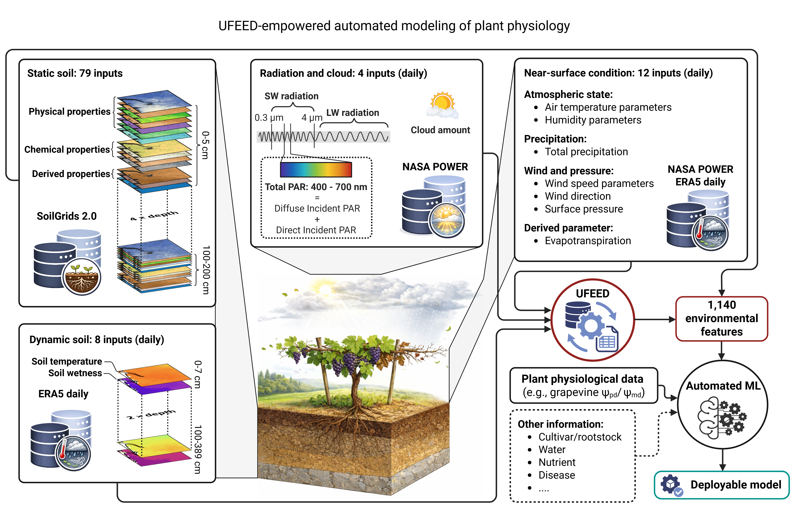

<p align="center">
  
</p>

<h1 align="center">UFEED</h1>

<p align="center">
  <strong>Universal Feature Extraction from Environmental Data</strong>
</p>

UFEED is an R package for downloading weather and soil data and creating
environmental features for plant physiology and crop modelling.



## Installation

Install the stable, paper-associated release from GitHub:

```r
install.packages("remotes")
remotes::install_github("imbaterry11/UFEED@v0.1.0", dependencies = TRUE)
library(UFEED)
```

Users can also
[download the v0.1.0 source archive](https://github.com/imbaterry11/UFEED/archive/refs/tags/v0.1.0.tar.gz).

Workflows using Google Earth Engine through `weather_data_source = "power_ee"`
also require a working [`rgee`](https://github.com/r-spatial/rgee)
configuration.

## Quick start

### Historical data

```r
ufeed_history <- UFEED_history(
  lon = 7.155,
  lat = 46.16,
  start_year = 2023,
  end_year = 2024,
  weather_data_source = "power",
  soil_data_source = "remote"
)
```

Multiple sites can be supplied as paired longitude and latitude vectors:

```r
ufeed_history <- UFEED_history(
  lon = c(7.155, 7.300),
  lat = c(46.160, 46.250),
  start_year = 2023,
  end_year = 2024,
  weather_data_source = "power",
  soil_data_source = "remote"
)
```

### Present season

```r
ufeed_present <- UFEED_present(
  lon = 7.155,
  lat = 46.16,
  weather_data_source = "power",
  soil_data_source = "remote"
)
```

`UFEED_present()` combines a historical weather backbone with recent and
forecast Open-Meteo data.

## Main functions

| Function | Purpose |
|---|---|
| `UFEED_history()` | Run the complete historical workflow. |
| `UFEED_present()` | Run the complete present-season workflow. |
| `UFEED_download_history_weather()` | Download historical daily weather. |
| `UFEED_download_present_weather()` | Download present-season weather. |
| `UFEED_compute_weather_features()` | Compute selected core feature modules. |
| `UFEED_get_soil_features()` | Extract SoilGrids soil features. |
| `UFEED_wrap_up()` | Combine weather, derived features, and soil data. |

## Choosing data sources

### Weather

| Option | Recommended use | Setup |
|---|---|---|
| `"power"` | Easiest option and suitable for most workflows. | None |
| `"power_open_meteo"` | Higher-resolution weather without Earth Engine. | None for normal use, but free [API call limits](https://open-meteo.com/en/terms) apply |
| `"power_ee"` | ERA5-Land data through Google Earth Engine. | `rgee`, Earth Engine authentication, and a cloud project |

Choose a source with the `weather_data_source` argument. See the
[NASA POWER](https://power.larc.nasa.gov/),
[Open-Meteo](https://open-meteo.com/), and
[Google Earth Engine](https://earthengine.google.com/) documentation for
provider-specific details and usage limits.

### Soil

| Option | Recommended use |
|---|---|
| `"remote"` | Small jobs and quick tests without local raster files. |
| `"local"` | Repeated analyses or many sites using downloaded SoilGrids rasters. |

Download the aggregated 1 km rasters from the
[ISRIC SoilGrids 1000 m directory](https://files.isric.org/soilgrids/latest/data_aggregated/1000m/).
Place all required depth-specific `.tif` files directly in one folder, without
variable-specific subfolders. For example:

```text
soilgrids_1k/
  bdod_0-5cm_mean_1000.tif
  bdod_5-15cm_mean_1000.tif
  ...
  clay_0-5cm_mean_1000.tif
  clay_5-15cm_mean_1000.tif
  ...
  wv1500_60-100cm_mean_1000.tif
  wv1500_100-200cm_mean_1000.tif
```

Then provide this folder to UFEED:

```r
soil_features <- UFEED_get_soil_features(
  lon = 7.155,
  lat = 46.16,
  soil_data_source = "local",
  soil_data_local_dir = "/path/to/soilgrids_1k"
)
```

## Using local weather data

Users can bypass weather downloading. Daily input must contain `Date`, `lon`,
and `lat`; cumulative-temperature features also require `T2M_MAX` and
`T2M_MIN`.

```r
weather <- readr::read_csv("local_weather.csv") |>
  dplyr::mutate(
    Date = as.Date(Date),
    lon = 7.155,
    lat = 46.16
  )

weather_features <- UFEED_compute_weather_features(
  weather_data = weather,
  feature_profile = "history"
)

soil_features <- UFEED_get_soil_features(
  lon = 7.155,
  lat = 46.16,
  soil_data_source = "remote"
)

ufeed_df <- UFEED_wrap_up(
  weather_data = weather,
  weather_features = weather_features,
  soil_features = soil_features
)
```

## Core feature modules

`UFEED_compute_weather_features()` provides four core modules:

| Module | Description |
|---|---|
| `"cumsum_features"` | Seasonal cumulative radiation and precipitation features. |
| `"EWMA_REWMA_features"` | Exponentially weighted moving features. |
| `"cumulative_temp_features"` | Chilling, growing-degree-day, and growing-degree-hour features. |
| `"season_summary_features"` | Seasonal maximum and minimum summaries. |

Modules can be selected explicitly:

```r
weather_features <- UFEED_compute_weather_features(
  weather_data = weather,
  feature_profile = "history",
  included_module = c("EWMA_REWMA_features", "cumulative_temp_features")
)
```

See the function documentation for advanced column selection, window lengths,
temperature bases, and chilling-model settings.

## Feature inventory

Use
[`UFEED_feature_inventory.csv`](UFEED_feature_inventory.csv)
as the reference dictionary for UFEED 0.1.0 output columns. It records each
core feature's definition, unit, required inputs, temporal direction,
generating module, and relevant notes.

## Under development

Atmospheric-demand and surface-energy/radiation expansion helpers are under
development and are not included in UFEED 0.1.0.

## License

UFEED is released under the MIT license.

## Citation

If you use UFEED in a publication or analysis, please cite the UFEED software
repository and the associated manuscript describing the environmental
feature-engineering workflow.
